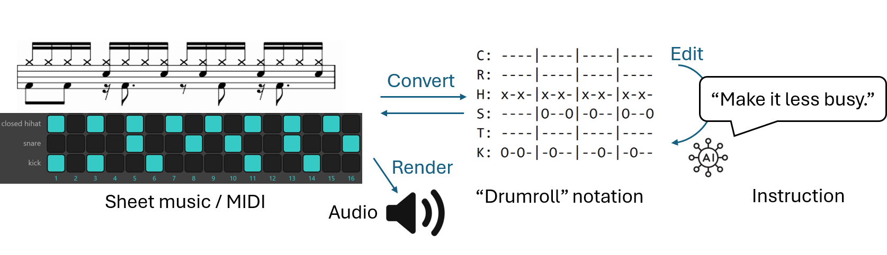

# Not that Groove: Symbolic Drum Groove Editing with 0-shot LLMs

## Motivation
In popular music, producers typically use a drum machine (such as [this one](https://drumbit.app/)) to create a drum groove which underpins many genres of music. This can be seen as a representative snapshot of the workflow creating music with MIDI, plugins, samples, which is a series of symbolic operations. However, when the drum groove is not initally satisfactory, producers must rely on expertise or trial-and-error to edit it. Here, we conduct a case study to show it is possible to **prompt an LLM in a zero-shot manner to edit symbolic drum grooves**. 

## Dataset
The *Not that Groove* dataset ([development set](prompts/requests_instantiated.json)) ([test set](prompts/requests_unrolled.json)) includes manually annotated and automatically augmented tuples of original grooves, instructions, and unit tests to check minimal requiements of the edited groove. 

## Evaluation
To run a model, go to `/source` and do
> python evaluate.py --model MODEL_NAME --data DATA_TYPE [--start START_ID] [--silent]

- MODEL_NAME is any model name in HuggingFace or OpenAI API
- DATA_TYPE is either 
  - `instantiated`: the developement set (each templated instruction is instantiated once), or 
  - `unrolled`: the test set (each templated instruction is instantiated multiple times by all possibilities)
- The model edits all grooves in the order of ID in the dataset JSON introduced above

Running this command will create multiple folders in `/output/DATA_TYPE/MODEL_NAME`:
- `raw/`: the raw output of the LLM
- `notation/`: the extracted drumroll notation of the edited groove
- `test_results/`: results of the unit tests that operate upon the drumroll notation of the edited groove
- `midi/`: the MIDI file that the notation is converted into
- `audio/`: the audio rendered by triggering [samples](/samples), which exist for each instrument, articulation, and hard or soft hit